# Implementation and Acceleration of a Support Vector Machine Classifier on the ZCU102 FPGA Platform

This project aims to design, implement, and evaluate a hardware-accelerated SVM inference engine on the ZCU102 board. The objective is not only functional correctness but a quantified comparison between a software (CPU) baseline and a hardware-accelerated (FPGA) implementation in terms of execution latency, throughput, and classification accuracy.

## SVM Algorithm Review and Design Specification

In Support Vector Machines, the boundary line is called a hyperplane. The boundary lines parallel to the hyperplane that touch the closest sample points define the margin. The specific sample points touching these boundary lines are called Support Vectors.

The goal is to draw a straight line that cleanly divides the blue triangles from the green circles. While many lines could separate these groups, an optimal line leaves the widest possible margin on both sides.

<p align="center">
  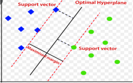
</p>

> **SVM Inference Equation:**

<p align="center">
  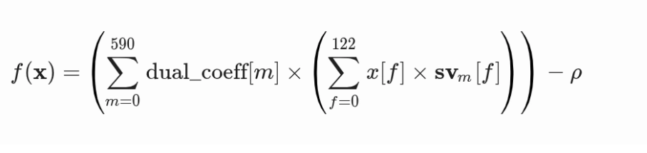
</p>

> Where αᵢ are the dual coefficients, yᵢ are class labels, K(·,·) is the kernel function, and b is the bias offset.

The SVM model's operational flow was analyzed by deeply understanding its core inference equation. As illustrated below, this mathematical formula was mapped into a sequential, five-step execution pipeline that clearly defines the exact step-by-step calculations required for the final classification decision.

<p align="center">
  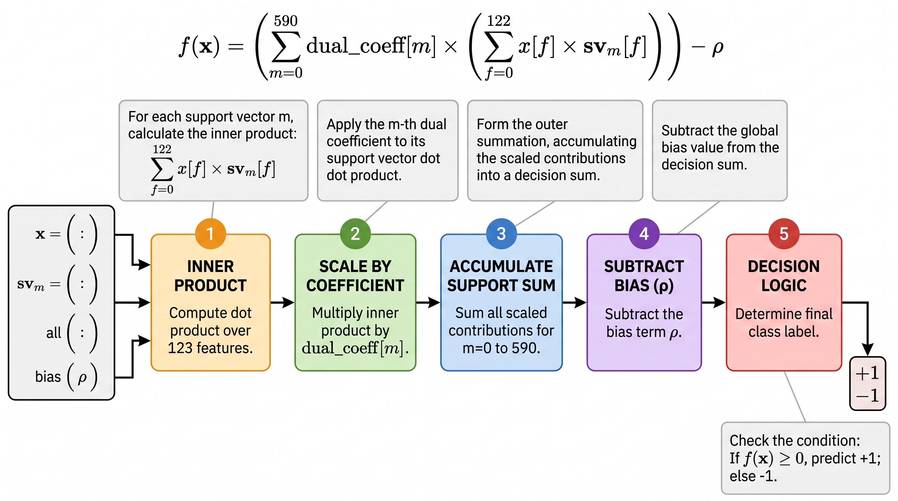
</p>

## Train the SVM Offline Using LIBSVM

Training completed after 8,649 iterations.

**Properties:**

| Property | Value |
|---|---|
| Kernel type | Linear |
| Number of support vectors | 591 |
| Number of features | 123 |
| Number of dual coefficients | 591 |
| rho | 1.594468 |

<p align="center">
  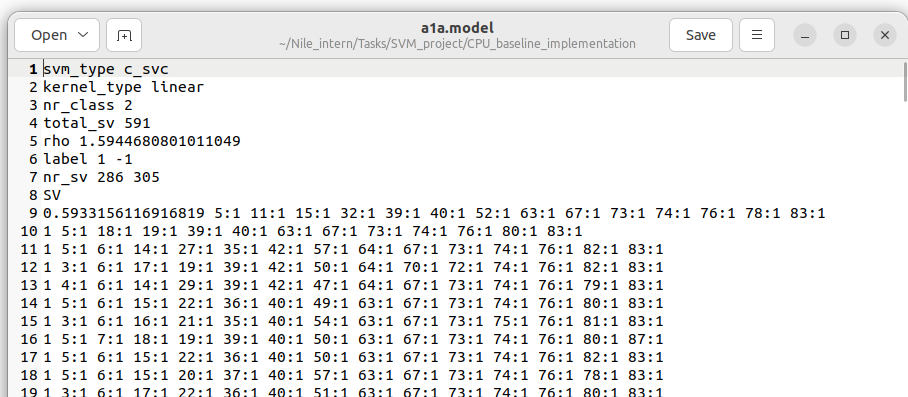
</p>

## Time Profiling & System Partitioning

<table>
  <tr>
    <td align="center">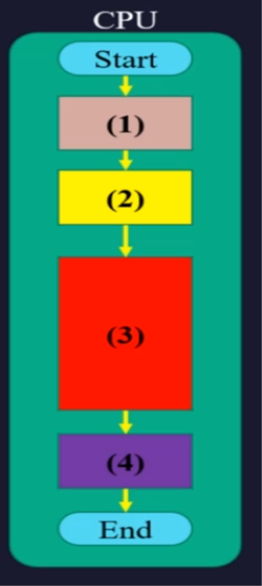</td>
    <td align="center">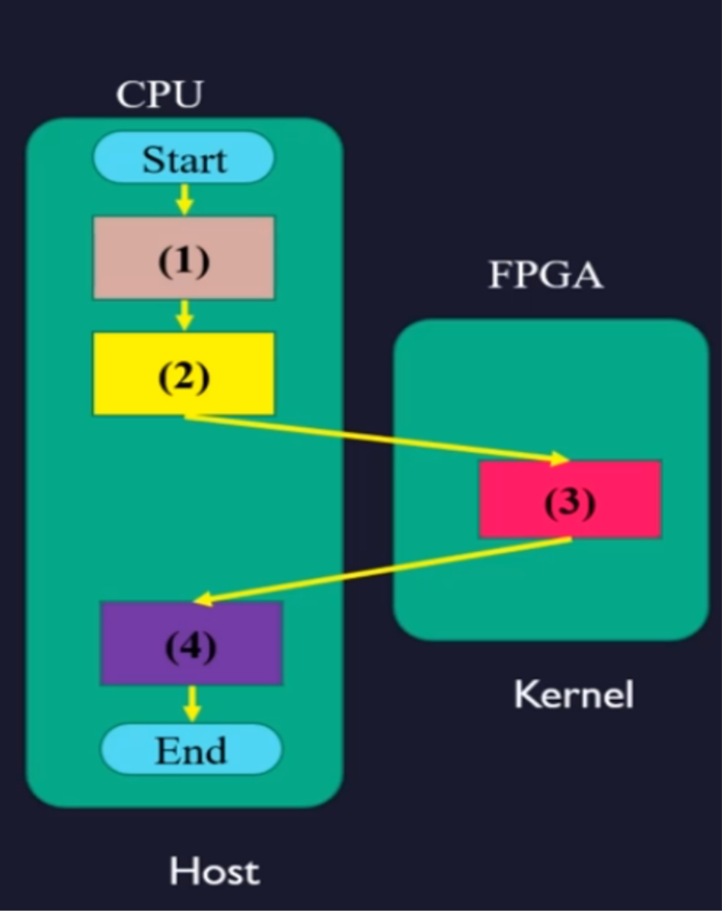</td>
  </tr>
</table>

**Time Profiling:** Evaluates CPU baseline execution to analyze time distribution per function, and locates computational bottlenecks (e.g., matrix operations and loops) as candidates for acceleration.

**System Partitioning:**
- **Software (CPU):** Control logic, file I/O, data parsing, and pre/post-processing.
- **Hardware (FPGA):** Compute-heavy mathematical kernels targeted for acceleration.

### CPU Baseline Implementation

<p align="center">
  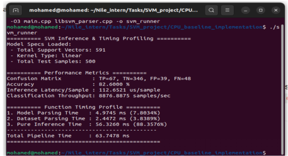
</p>

The goal of this phase is to establish a software baseline before hardware acceleration. This baseline provides the reference performance against which the FPGA implementation will be compared.

A detailed timing profile was performed by separating execution into three main stages:

1. **Model Parsing** — Reading and loading the LIBSVM model into memory.
2. **Dataset Parsing** — Reading and preparing the input test samples.
3. **Pure Inference** — Executing the SVM classification algorithm on the CPU.

The timing profile clearly indicates that Pure Inference dominates the total execution time, accounting for approximately 88% of the overall pipeline. This is expected, since the inference stage performs the computationally intensive SVM operations, including numerous multiply-accumulate (MAC) computations and dot-product calculations between each input sample and all support vectors.

<p align="center">
  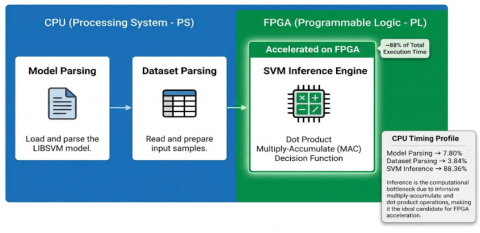
</p>

Since the vast majority of execution time is spent in the inference stage, it becomes the primary performance bottleneck. Therefore, the FPGA implementation focuses on accelerating only the inference engine, where the large amount of parallel computation can be efficiently mapped to hardware. The parsing stages remain on the CPU because they contribute only a small fraction of total execution time and would provide minimal improvement if accelerated.

## Vitis

### Host Program

1. **Environment Setup & Initialization** — The host program sets up the OpenCL environment (targeting OpenCL 1.2 for Xilinx XRT compatibility), including `<CL/cl2.hpp>` headers to create the software objects (Platform, Device, Context, CommandQueue) that orchestrate communication between the CPU and the FPGA.

2. **Data Loading & Parsing (Software Phase)** — Running purely on the CPU, the program reads the necessary file artifacts from the current directory. It parses the trained model (`a1a.model`) and the test dataset (`a1a.t`) into system RAM, while simultaneously preparing to load the compiled FPGA bitstream (`.xclbin`).

3. **Memory Alignment & Data Flattening** — To ensure the FPGA's DMA engine can read data efficiently, the host code optimizes the data layout:
   - **Flattening:** Converts nested 2D data structures (scattered in memory) into contiguous 1D vectors, allowing hardware to use fast, streaming burst reads.
   - **Alignment:** Uses a custom `aligned_allocator` to align memory start addresses to 4096-byte (4 KB) boundaries, preventing alignment overhead during data transfers.

4. **FPGA Configuration & Hardware Binding** — The host loads the `.xclbin` bitstream into runtime memory to configure the FPGA, then creates a `cl::Kernel` object to bind a software handle to the specific hardware function (e.g., `svm_kernel_accel`).

5. **Buffer Allocation** — The host allocates `cl::Buffer` objects, which act as references to designated memory regions inside the FPGA's off-chip DDR memory. Using the `CL_MEM_USE_HOST_PTR` flag, the host maps OpenCL buffers directly to the aligned CPU memory pointers, avoiding redundant intermediate memory copies on the CPU side.

6. **Host to FPGA Transfer** — The CPU copies the flattened, aligned dataset and model parameters from Host RAM over the PCIe bus into the FPGA's global DDR memory.

7. **Kernel Launch & Execution** — The host issues a command to launch the kernel. The FPGA takes over and executes the hardware-accelerated function (the SVM computations) using the data now residing in its DDR memory.

8. **Results Transfer & Verification** — Once the FPGA finishes computing, the host reads the output by copying results from the FPGA's DDR memory back to CPU memory. Finally, the host program verifies prediction accuracy and cleans up the execution environment.

<p align="center">
  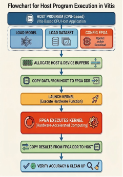
</p>

### Vitis Kernel

**Definition:** An isolated, compute-intensive function (C/C++) compiled into dedicated FPGA hardware logic.

**HLS Directives (Pragmas):** Guide the Vitis HLS compiler to optimize hardware architecture and parallel execution.

<p align="center">
  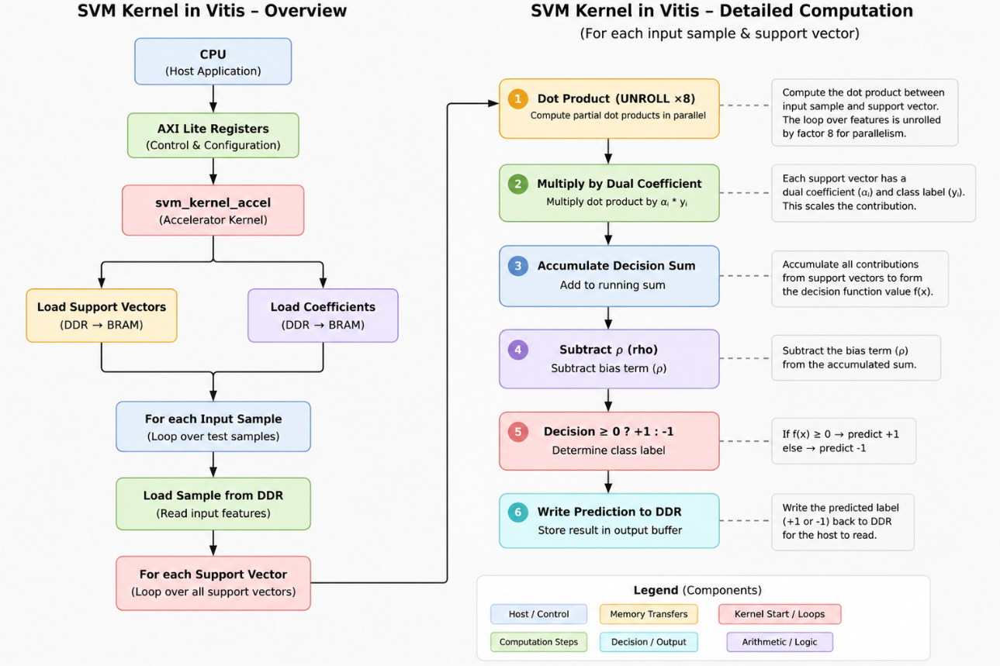
</p>

### Optimization in Kernel

#### ARRAY_PARTITION

```
#pragma HLS ARRAY_PARTITION
```

This is one of the most critical optimizations in HLS.

If you have data stored in memory:

<p align="center">
  
</p>

**Without partitioning:** A standard BRAM port can only read 1 element per clock cycle.

**After applying `factor=8`:** The memory is split into separate banks:

<p align="center">
  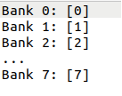
</p>

Now the hardware can read all 8 features simultaneously in the same clock cycle. This is precisely why the UNROLL factor works — unrolling hardware logic only achieves true parallelism if memory bandwidth can feed all parallel units at once.

#### PIPELINE — Parallelism Across Iterations

**What is an iteration?** Consider a loop that executes 4 times:

<p align="center">
  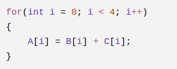
</p>

<p align="center">
  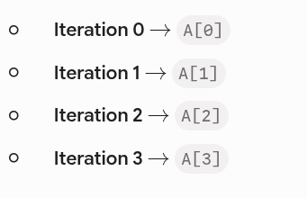
</p>

**Without pipelining:** Assume each iteration requires 3 clock cycles to complete:

<p align="center">
  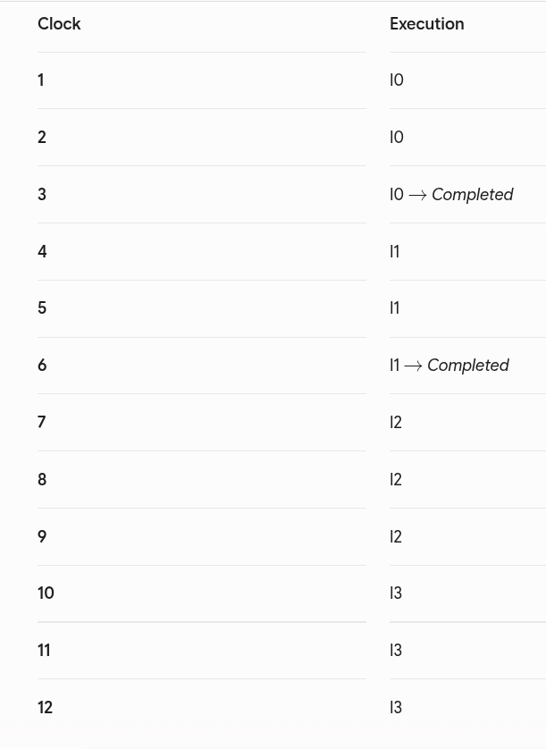
</p>

**With pipelining (II = 1):** HLS starts a new iteration every single clock cycle instead of waiting for the previous one to finish:

<p align="center">
  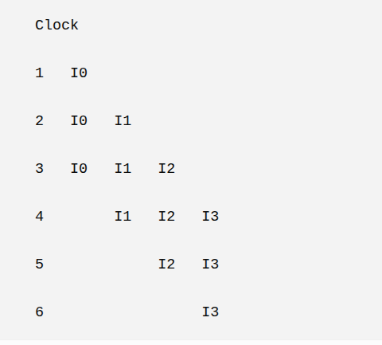
</p>

At clock 3, iterations 0, 1, and 2 are all running at the same time, each at a different stage of execution.

**What does PIPELINE actually do?** It does not reduce the time taken by a single iteration. Instead, it increases the number of iterations running concurrently — increasing **throughput**, not latency.

#### UNROLL — Parallelism Inside One Iteration

Consider a loop with 8 features:

<p align="center">
  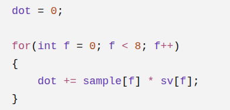
</p>

**Without UNROLL:** There is only 1 multiplier, so operations execute sequentially:

<p align="center">
  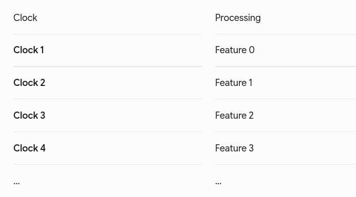
</p>

The same multiplier is used 8 times in a row.

**With `#pragma HLS UNROLL factor=8`:** HLS builds 8 multipliers in hardware instead of 1:

<p align="center">
  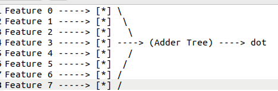
</p>

All 8 execute in the very same clock cycle.

**What does UNROLL actually do?** It decreases the time needed to finish the loop by executing the operations inside it in parallel, replicating hardware resources to achieve the speedup.

### Applying This to the SVM Kernel

In this design:
- The **outer loop** (`EVAL_SV_LOOP`) has **PIPELINE** applied.
- The **inner loop** (`DOT_PRODUCT_LOOP`) has **UNROLL** applied.

<p align="center">
  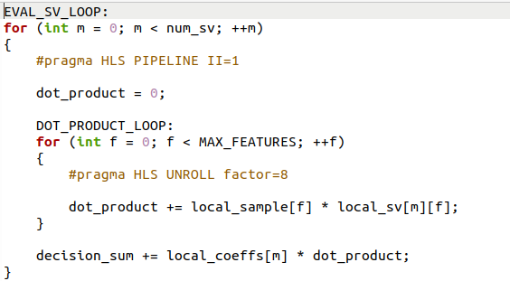
</p>

Assume:
- Number of Support Vectors (`num_sv`) = **3**
- Number of Features (`MAX_FEATURES`) = **8**

**First — UNROLL:**

Without UNROLL (for SV0), computing a single dot product takes 8 clock cycles:

<p align="center">
  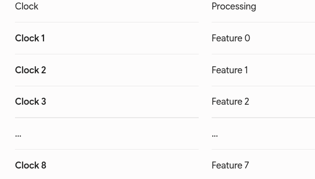
</p>

With `#pragma HLS UNROLL factor=8`, all multiplications execute together:

<p align="center">
  
</p>

UNROLL sped up the calculation of a single dot product.

**Second — PIPELINE:**

Now that computing each support vector is fast, PIPELINE comes into play.

Without PIPELINE, SV1 does not start until SV0 is completely finished:

<p align="center">
  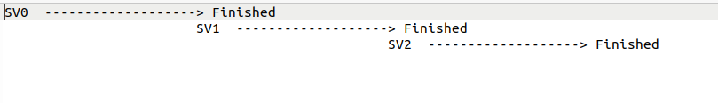
</p>

With `#pragma HLS PIPELINE II=1`, SV0 is still executing while SV1 and SV2 have already started:

<p align="center">
  
</p>

PIPELINE allows processing of a new support vector to start every clock cycle.

**Combining both together:**

<p align="center">
  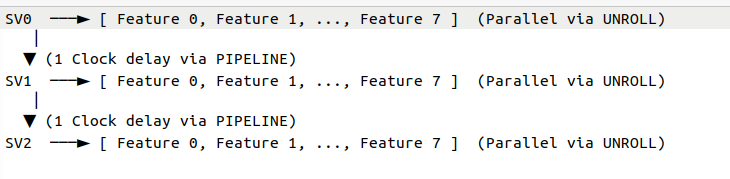
</p>

### Software Emulation Result on Vitis

Software Emulation in the Vitis IDE was used to verify host-kernel communication and functional correctness before initiating the time-consuming hardware build. Although virtualization overhead yields performance metrics worse than the CPU baseline, this phase is strictly for rapid bug detection and functional validation prior to physical FPGA deployment.

<p align="center">
  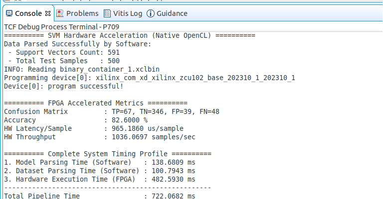
</p>

## Host Integration and Functional Testing

The synthesized kernel is integrated with a host application and deployed to the ZCU102 board using the Vitis embedded platform flow.

In this final phase, the complete acceleration framework was deployed onto the physical Xilinx Zynq UltraScale+ MPSoC ZCU102 Evaluation Kit using SD Card Boot Mode, transitioning away from interactive JTAG debugging to a standalone Embedded Linux environment.

### 1. SD Card Preparation and Partitioning

Using the GParted disk management utility, the SD card was formatted and split into two distinct primary partitions:

**boot partition (FAT32)** — Contains the essential bootloader components and runtime deployment artifacts generated by Vitis:
- `BOOT.BIN` (First Stage Bootloader / FSBL, PMU Firmware, and U-Boot)
- `boot.scr` (U-Boot configuration script)
- `Image` (Linux Kernel Image)
- `binary_container_1.xclbin` (FPGA hardware bitstream)
- `svm_model` (compiled C++ host executable)
- Model & dataset files: `a1a.model` and `a1a.t`

<p align="center">
  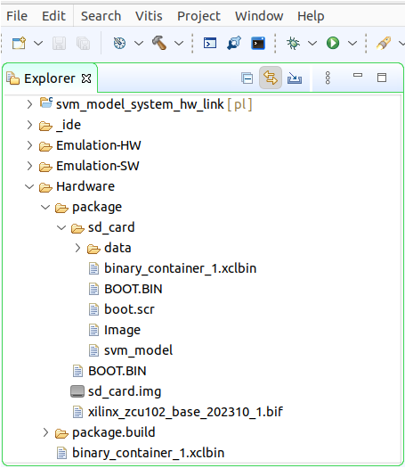
</p>

**rootfs partition (ext4)** — Extracted from the Xilinx Linux Common Image (`rootfs.tar.gz`), hosting the complete Linux target root filesystem, standard libraries, and XRT (Xilinx Runtime) environment.

<p align="center">
  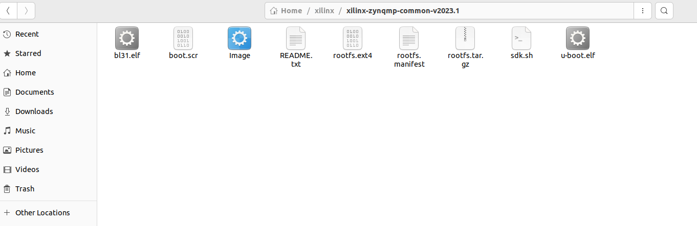
</p>

### 2. Board Configuration and Hardware Setup

To configure the board for SD Card booting rather than JTAG:

- **DIP Switch Settings (SW6):** Boot mode switches were set to E-MODE / SD Card Boot by configuring the DIP switches to `0111` (SW6 pins [1:4] set to ON-OFF-OFF-OFF).
- **UART Serial Interface:** The host PC was connected to the board via USB (UART USB0 port). A serial terminal emulator (GtkTerm) was launched on the host machine at a standard baud rate of 115200 to monitor the Embedded Linux boot sequence and interact with the kernel.

<p align="center">
  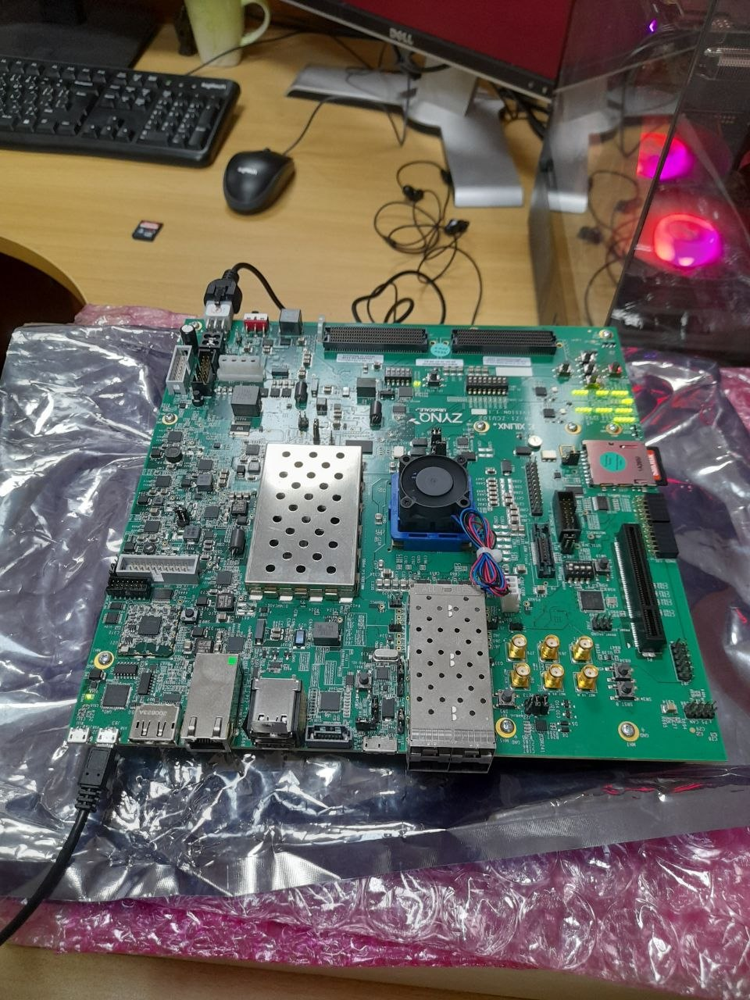
</p>

### 3. Execution & Verification

Once Embedded Linux booted successfully, the host executable was launched via the terminal to evaluate the SVM acceleration:

```
./svm_model binary_container_1.xclbin a1a.model a1a.t
```

The execution verified that the hardware bitstream was successfully loaded into the Programmable Logic (PL) via XRT, completing the SVM inference on the acceleration platform and displaying real-time benchmark results over UART.

## Hardware Results & Inference Speedup

<p align="center">
  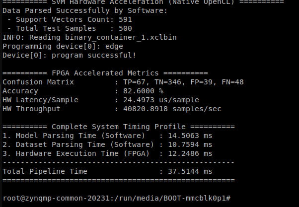
</p>

Upon deploying the design onto the physical hardware (ZCU102 board), the inference latency was significantly reduced from **56 ms** (software baseline) down to **12 ms**, achieving a **4.67× speedup** and demonstrating the efficiency of the FPGA hardware acceleration architecture.

<p align="center">
  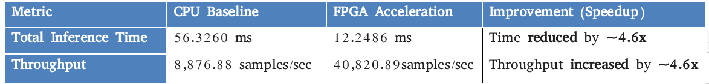
</p>

| Metric | CPU Baseline | | FPGA Accelerated |
|---|---|---|---|
| Latency | 56 ms | — | **12 ms** |
| Throughput | 8,876.88 samples/sec | — | **40,820.89 samples/sec** |
| Speedup | 1× (baseline) | — | **~4.67× faster** |
